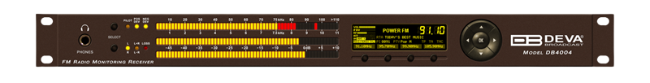

# DEVA 4004 Home Assistant Custom Component

  

This is a custom component for Home Assistant that allows you to interact with the DEVA 4004 device via the SNMP protocol.

## Installation

### HACS Installation

If you have the HACS (Home Assistant Community Store) installed:

1. Go to the HACS page on your Home Assistant instance.
2. Click on "Integrations".
3. Click on the three dots in the top right corner and select "Custom repositories".
4. In the "Add custom repository" field enter the URL of this GitHub repository, select "Integration" as the category, and then click "ADD".
5. You should now see the DEVA 4004 integration in the HACS store. Click on it and then click on "Install this repository in HACS".
6. Restart Home Assistant to load the component.

### Manual Installation

If you prefer to install the component manually:

1. Clone this repository or download the source code as a zip file and extract it in your `/config/custom_components/` directory. If the directory does not exist, create it first.
2. Restart Home Assistant to load the component.

## Configuration

The configuration is done via the Home Assistant UI where you can input the device's IP address, port, and the SNMP community for read operations.

**Required Information**:

- `Device Name`: The name of the DEVA 4004 device (default: "DEVA4004").
- `Device IP Address`: The IP address of the DEVA 4004 device.
- `Device Port`: The port to be used (default: 161).
- `SNMP Read Community`: The SNMP community for read operations (default: "DEVA4004").
- `SNMP Write Community (Optional)`: The SNMP community for write operations, if applicable.

## Options

These options can be adjusted in the options flow for the DEVA 4004 integration after it has been added:

- `Data Poll Interval (seconds)`: The interval between data polls (default: 3 seconds).
- `Alarm Poll Interval (seconds)`: The interval between alarm polls (default: 90 seconds).

## Contributing

We welcome contributions from the open-source community. Please submit a pull request or open an issue if you want to make changes or propose new features.

## License

This project is licensed under the MIT License. See the LICENSE file for details.

## Disclaimer

This custom component is developed and maintained independently. Use at your own risk.

## Support

For support and more information about the DEVA 4004 Home Assistant custom component, please visit the GitHub repository [issue page](https://github.com/s1lvi0/deva4004/issues).
